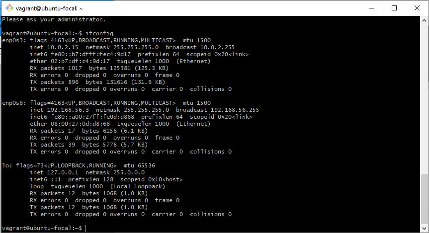

  # AltSchool-Cloud-Exercise-2-Week-2

>  

- [Back to first page](../README.md)
- [Overview](#overview) 
- [Task](#task-exercise-2💻) 
- [My process](#my-process)
- [ifconfig Output](#ifconfig-output) 
- [Link to vagrantfile](https://github.com/Bukola-Testimony/AltSchool-Cloud-Exercices/blob/main/Exercise-2/Vagrantfile) 
- [Author](#author)

 
 

## Overview
LEARNING CLOUD ENGINEERING WITH ALTSCHOOL.

It has been exactly 2 weeks of learning cloud engineering with AltSchool.There has been so much new concepts to learn. It has been a loaded week of sleepless nights and a lot to learn, but the progress is well worth it.  

This week I have learnt the different paths in cloud Engineering.
The history of and evolution of operating systems.
Evolution of Linux distros which is the most commonly used around the world.
I learned The difference between Physical hardware and virtual machines(VM) for which there is a need to set up a virtualization software.  
I also Learned several linux commands and still researching more.

 
 

### TASK  EXERCISE 2💻

- Set up Ubuntu 20.04LTS on your machine using vagrant. 
- Customize your vagrantfile as necessary with private_network set to "dhcp"
- Once the machine is up, run "ifconfig" and share the output in your submission along with vagrant file. 

 
 

## My process
- Installed and set up VirtualBox
- Installed and set up Vagrant
- Installed and set up Ubuntu Focal 20.04LTS

For this task, I downloaded, Installed and setup a vertualization software (Virtual Box) on my windows O/S.
I also downloaded, Installed and setup Vagrant(A Development environment) using git bash command. I created a vagrant folder for vagrant initialization on my system. 
Finally installed and set up ubuntu focal 20.04LTS on vagrant. 

I particularly had a challenge configuring private networks on vagrant as it kept getting some errors each time I want to power up the machine. With the help of some my colleagues and a lot of google searching, I was able to finally set up the machine and configured it to private network. 

 
 

## ifconfig output 
Note: see screenshot of output below.
 

> 

 
 

## Author

- Website - [Bukola Testimony](https://bukola-testimony.github.io/My-Portfolio-website/)
- Twitter - [@BukolaTestimony](https://twitter.com/BukolaTestimony)
