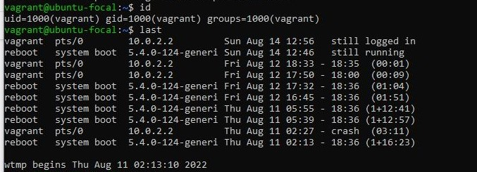

  # AltSchool-Cloud-Exercices-Week-2

>  

- [Back to first page](../README.md)
- [Overview](#overview) 
- [Task](#task-exercise-3💻) 
- [My process](#my-process)
- [Linux commands and their output](#linux-commands-and-their-output)
- [Author](#author)


<br>
## Overview
LEARNING CLOUD ENGINEERING WITH ALTSCHOOL.
<p>
It has been exactly 2 weeks of learning cloud engineering with AltSchool.There has been so much new concepts to learn. It has been a loaded week of sleepless nights and a lot to learn, but the progress is well worth it.  
</p>

<br>
<br>


### TASK (EXERCISE 3)💻

- Research online for 10 more linux commands asides the ones already mentione in this module. 
- Submit using your Altschool-cloud-exercise project, explaining what each command is used for, with examples of how to use each and example screenshot using each of them.

<br>
<br>


## My process
- I researched more linux commands online.
- Included the screenshots of using those commands and their output.

<br>
<br>


###  Linux commands and their output:

<br>

```console

# To Display how long the system has been running.
 ~$ uptime  

# To Display current month calendar.
~$ cal

# To Display who is online.
 ~$ w 
 
# To Display detailed information about RAM.
 ~$ free

```
<br>

> 


<br>
<br>


```console

# To display current date and time
~$ timedatectl  

# To set currentdate and time to Afica/Lagos
~$ sudo timedatectl set-timezone Africa/Lagos 

```
<br>

> 

<br>
<br>


```console

# To display the user and group ids of your current user.
~$ id 

# To display the last users who have logged onto the system.
~$ last    
```

<br>

> 
<br>
<br>


```console

# Display your currently running processes
~$ ps

# Display and manage the top processes
~$ top  
```
<br>

> 
<br>
<br>


```console

# Display total disk usage of the current directory
~$ du -sh

# Display disk usage for all files and directories in human readable format
~$ du -ah
 
```

<br>

> 
<br>
<br>


## Author

- Website - [Bukola Testimony](https://bukola-testimony.github.io/My-Portfolio-website/)
- Twitter - [@BukolaTestimony](https://twitter.com/BukolaTestimony)
