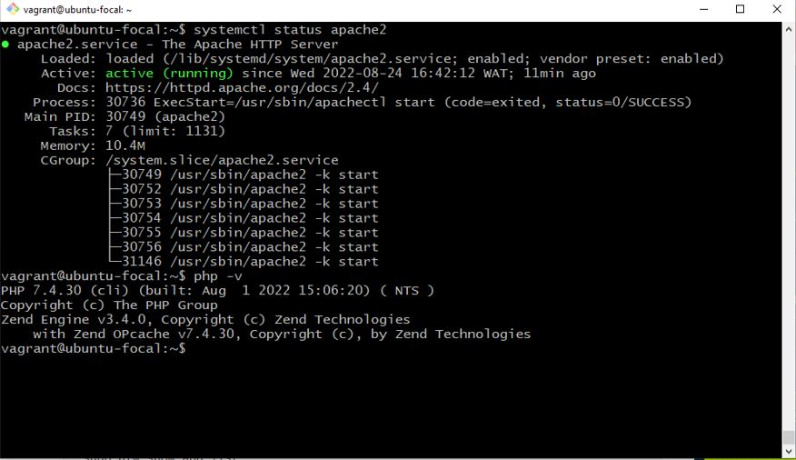
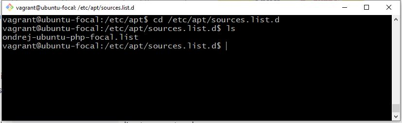
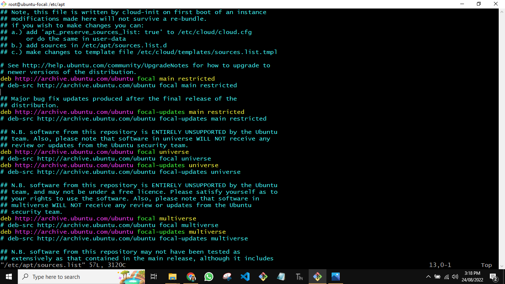

  # AltSchool-Cloud-Exercise-5-Week-2

>  

- [Back to first page](../README.md)
- [Overview](#overview) 
- [Task](#Task-EXERCISE-5) 
- [My process](#my-process)
- [Screenshots of output](#screenshot-of-output-of-php--v)
- [Author](#author)


## Overview
LEARNING CLOUD ENGINEERING WITH ALTSCHOOL.
<p>
It has been 3 weeks of learning cloud engineering with AltSchool.Things are getting better now as I am getting more familiar with cloud concepts.   
</p>

<br>
<br>


## Task EXERCISE 5💻
- Install PHP 7.4 on your linux machine using the ppa:ondrej/php package repo.


## My process

####  Installation of PHP 7.4 using ppa:ondrej/php package repo and apache

```console

# How to Install PHP on Ubuntu 20.04 
~$ sudo apt install software-properties-common
~$ sudo add-apt-repository ppa:ondrej/php
~$ sudo apt update
~$ sudo apt install -y php7.4
~$ php -v 

```

### Screenshot of output of php -v
<br>
> 


<br>
<br>

### Content of etc/apt/souces.list.d

```console

~$ vi /etc/apt/souces.list.d 

```
<br>
> 


<br>
<br>


### Content of etc/apt
```console

~$ vi /etc/apt/souces.list 

```
<br>

> 

<br>
<br>


## Author

- Website - [Bukola Testimony](https://bukola-testimony.github.io/My-Portfolio-website/)
- Twitter - [@BukolaTestimony](https://twitter.com/BukolaTestimony)
