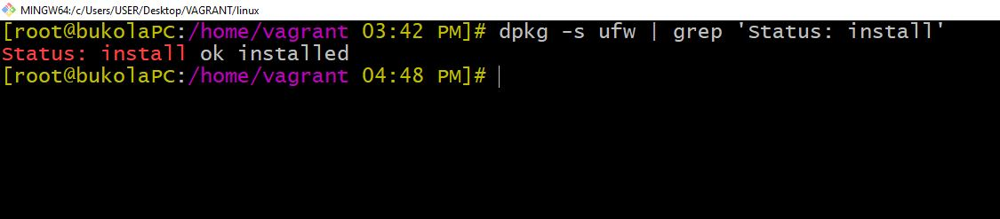
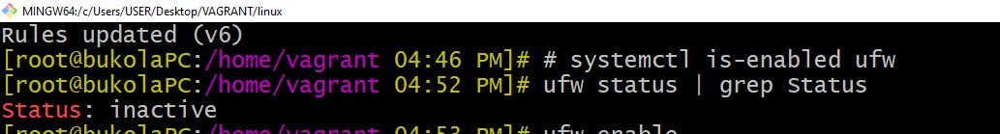
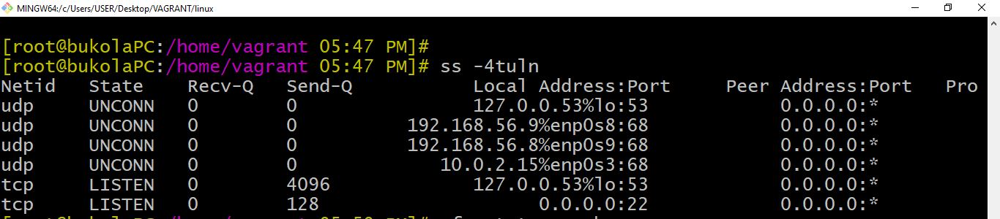
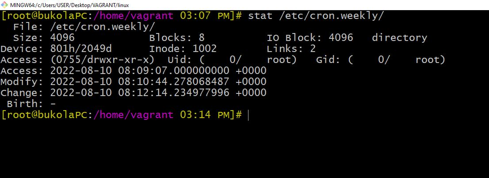

  # AltSchool-Cloud-Exercices-Week-5

>  

- [Back to first page-Introduction](https://github.com/Bukola-Testimony/AltSchool-Cloud-Exercices)
- [Overview](#overview) 
- [Task](#Task) 
- [My process](#my-process)
- [Author](#author)


[Back to first page](/README.md)
[Back to first page](./README.md)
[Back to first page](../README.md)


## Overview
LEARNING CLOUD ENGINEERING WITH ALTSCHOOL.
<p>
It has been exactly 5 weeks of learning cloud engineering with AltSchool.There has been so many new concepts to learn. This is the first in september.
</p> 
<p>This week we learnt systemd which is a Linux initialization system and service manager,systemd utilities like systemctl and journalctl. Systemd Units generally refer to services, mount points, devices or sockets on the system. installation andconfiguration of apache service.
</p>
<p>We also learnt about the CIS Benchmark which are best practices for the secure configuration of a target system. Others include linux firewall and other hardening processes.
</p>
<br>
<br>


## Task EXERCISE 7💻
- Review the CIS Benchmark for Ubuntu.
- Implement at least 10 of the recommendations that was made on your system.

<br>
<br>


## My process
- I reviewed the CIS Benchmark for Ubuntu. 
- I made 10 audit and recommendation actions on my virtual machines. 
- The process and screenshots have been added to this exercise. 

<br>
<br>

# CIS Security Benchmark
**CIS Benchmarks are best practices for the secure configuration of a target system. CIS Benchmarks are the only consensus-based, best-practice security configuration guides both developed and accepted by government, business, industry, and academia.**
<br>
<br>
<br>


##  Firewall Configuration
A firewall is a set of rules. When a data packet moves into or out of a protected network
space, its contents (in particular, information about its origin, target, and the protocol it plans to use) are tested against the firewall rules to see if it should be allowed through
<br>
<br>


##  (1)   3.5.1.1 Ensure ufw is installed (Automated)

### Audit:
Run the following command to verify that Uncomplicated Firewall (UFW) is installed:

```console
# dpkg -s ufw | grep 'Status: install'
Status: install ok installed

```
<br>

<br>


### (2)   3.5.1.2 Ensure iptables-persistent is not installed with ufw (Automated)

### Audit:
Run the following command to verify that the iptables-persistent package is not installed:

```console
#  dpkg-query -s iptables-persistent
package 'iptables-persistent' is not installed and no information is
available

```
<br>

<br>  


### (3)   3.5.1.3 Ensure ufw service is enabled (Automated)

Notes:
 When running ufw enable or starting ufw via its initscript, ufw will flush its chains.
 This is required so ufw can maintain a consistent state, but it may drop existing
 connections (eg ssh). ufw does support adding rules before enabling the firewall.
 Run the following command before running ufw enable:

```console
# ufw allow proto tcp from any to any port 22

```
<br>

<br>


### Audit:
Run the following command to verify that ufw is enabled:

```console
# systemctl is-enabled ufw
enabled

```
<br>

<br>


Run the following command to verify that ufw is running:

```console
# ufw status | grep Status
Status: active
enabled

```
<br>

<br>


### Remediation:
Run the following command to enable ufw:

```console
# ufw enable

```

<br>


<br>  


### (4)   3.5.1.4 Ensure ufw loopback traffic is configured (Automated)

### Audit:
Run the following commands and verify output includes the listed rules in order:


```console
# ufw status verbose

```
<br>

<br>

### Remediation:
Run the following commands to implement the loopback rules:

```console
# ufw allow in on lo
# ufw allow out on lo
# ufw deny in from 127.0.0.0/8
# ufw deny in from ::1

```
<br>


<br>


### (5)   3.5.1.6 Ensure ufw firewall rules exist for all open ports (Manual)

### Audit:
Run the following command to determine open ports:


```console
# ss -4tuln

```

<br>

<br>

Run the following command to determine firewall rules:

```console
# ufw status verbose

```

<br>

<br>


### (6)   5.1.1 Ensure cron daemon is enabled and running (Automated)

### Audit:
Run the following command to verify cron is enabled:

```console
# systemctl is-enabled cron
enabled

```
<br>

<br>

Run the following command to verify that cron is running:

```console
# systemctl status cron | grep 'Active: active (running) '
Active: active (running) since <Day Date Time>

```
<br>

<br>


### Remediation:
Run the following command to enable and start cron:

```console
# systemctl --now enable cron

```

<br>

<br>


### (7)   5.1.2 Ensure permissions on /etc/crontab are configured (Automated)

### Audit:
Run the following command and verify Uid and Gid are both 0/root and Access does not grant permissions to group or other :

```console
# stat /etc/crontab
Access: (0600/-rw-------) Uid: ( 0/ root) Gid: ( 0/ root)

```
<br>

<br>


### Remediation:
Run the following commands to set ownership and permissions on /etc/crontab :

```console
# chown root:root /etc/crontab
# chmod og-rwx /etc/crontab

```
<br>

<br>


### (8)   5.1.3 Ensure permissions on /etc/cron.hourly are configured 

### Audit:
Run the following command and verify Uid and Gid are both 0/root and Access does not grant permissions to group or other:

```console
# stat /etc/cron.hourly/
Access: (0700/drwx------) Uid: ( 0/ root) Gid: ( 0/ root)

```
<br>

<br>

### Remediation:
Run the following commands to set ownership and permissions on the /etc/cron.hourly directory:

```console
# chown root:root /etc/cron.hourly/
# chmod og-rwx /etc/cron.hourly/

```
<br>

<br>


### (9)   5.1.5 Ensure permissions on /etc/cron.weekly are configured(Automated)
 

### Audit:
Run the following command and verify Uid and Gid are both 0/root and Access does not grant permissions to group or other:

```console
# stat /etc/cron.weekly/
Access: (0700/drwx------) Uid: ( 0/ root) Gid: ( 0/ root)

```
<br>

<br>

### Remediation:
Run the following commands to set ownership and permissions on the /etc/cron.weekly directory:

```console
# chown root:root /etc/cron.weekly/
# chmod og-rwx /etc/cron.weekly/

```
<br>

<br>


### (10)   5.1.8 Ensure cron is restricted to authorized users (Automated)
 

### Audit:
Run the following command and verify that /etc/cron.deny does not exist:

```console
# stat /etc/cron.deny
stat: cannot stat `/etc/cron.deny': No such file or directory

```
<br>

<br>

Run the following command and verify Uid and Gid are both 0/root and Access, does not grant write or execute to group, and does not grant permissions to other for /etc/cron.allow:

```console
# stat /etc/cron.allow
Access: (0640/-rw-r-----) Uid: ( 0/ root) Gid: ( 0/ root)

```

### Remediation:
Run the following commands to remove /etc/cron.deny:

```console
# rm /etc/cron.deny

```

Run the following command to create /etc/cron.allow

```console
# touch /etc/cron.allow

```
<br>

<br>


Run the following commands to set permissions and ownership for /etc/cron.allow:

```console
# chmod g-wx,o-rwx /etc/cron.allow
# chown root:root /etc/cron.allow

```
<br>


<br>
<br>

## Author

- Website - [Bukola Testimony](https://bukola-testimony.github.io/My-Portfolio-website/)
- Twitter - [@BukolaTestimony](https://twitter.com/BukolaTestimony)
