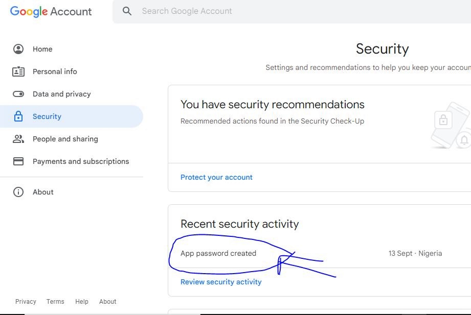
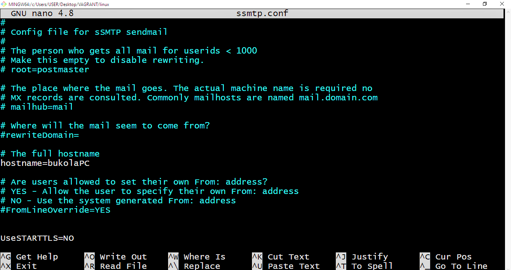
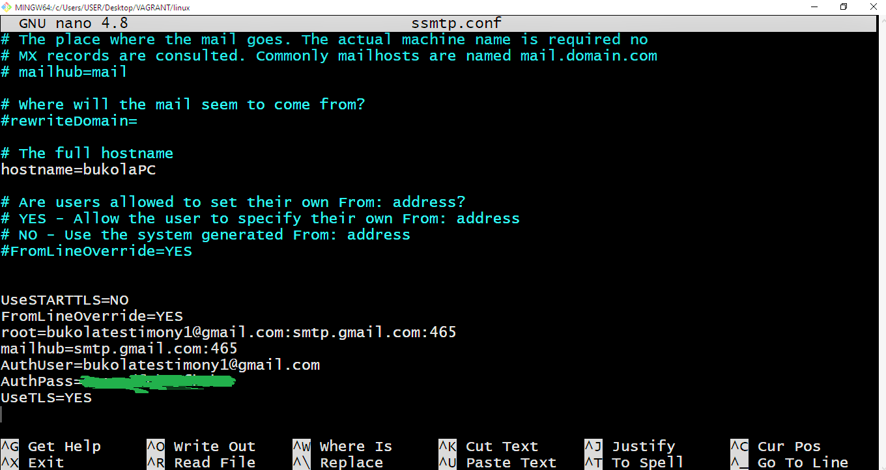
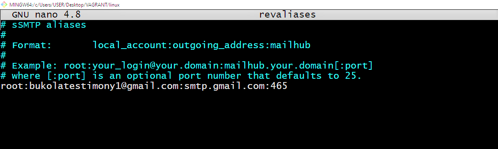
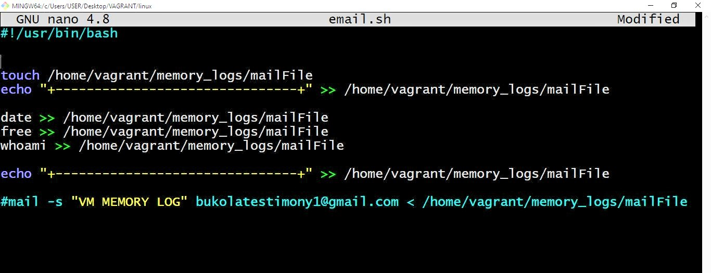
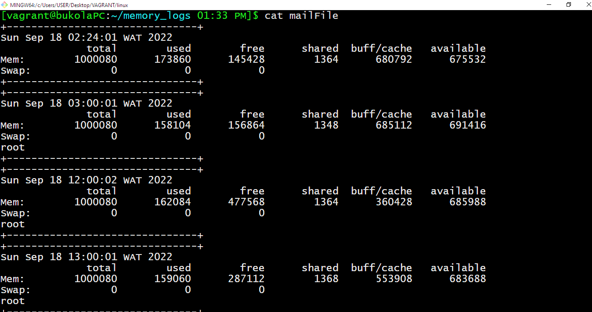
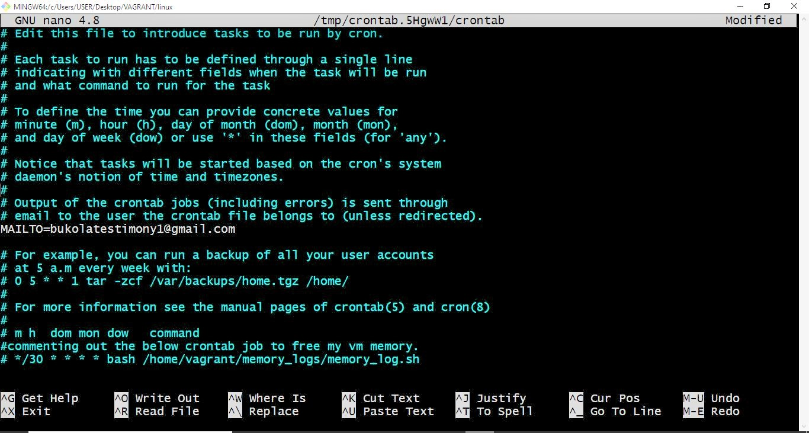
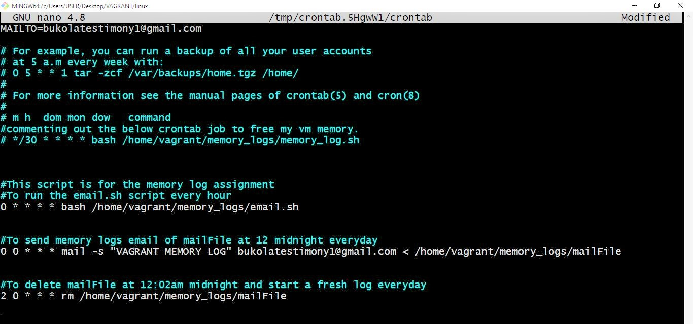
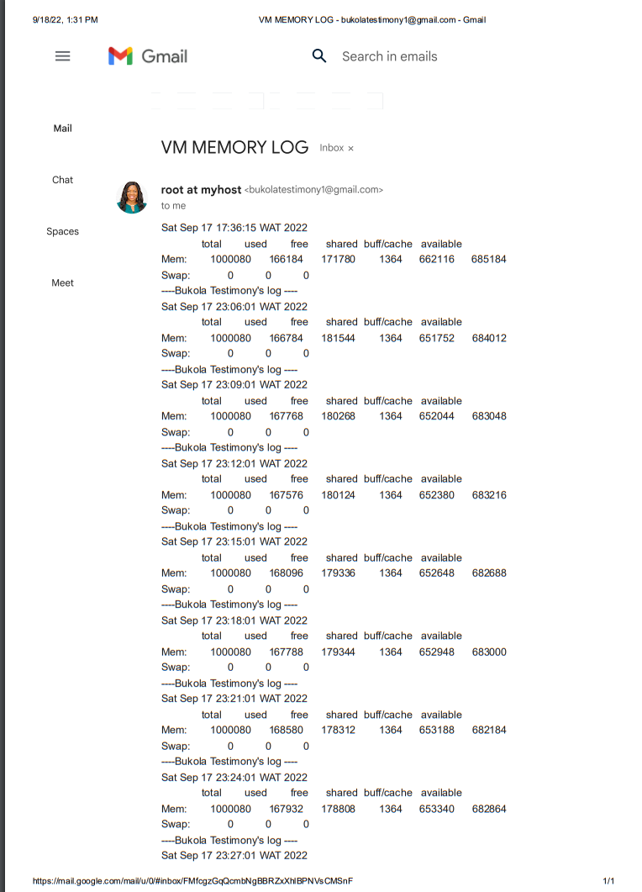
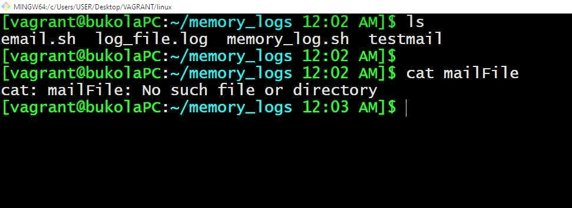

  # AltSchool-Cloud-Exercise-8-Week-6


>  

- [Back to first page](../README.md)
- [Overview](#overview) 
- [Task](#Task-EXERCISE-8) 
- [My process](#my-process)
- [Author](#author)


<br>

## Overview
#### LEARNING CLOUD ENGINEERING WITH ALTSCHOOL.
<p>
It has been exactly 6 weeks of learning cloud engineering with AltSchool.There has been so many new concepts to learn. This is the second in september.
</p> 
<p>This week we learnt Bash scripting. With Bash scripting comes conditional statements, iterations and Functions. File permissions needs to be set to executable to run an executable bash script. These files are started with a shebang line: !#/bin/bash. Bash scripting also allows for automation of scripts that runs within the linux environment.
</p>

<p>We also learnt about Crontab. This allows you to schedule commands or any application to run on the system. Cron job format : * * * * * which are minutes, hours, day, month, weekday respectively.
</p>
<br>
<br>


## Task EXERCISE 8💻
-  Create a bash script to run at every hour, saving system memory (RAM) usage to a specified file and at midnight it sends the content of the file to a specified email address, then start over for the next day.
- The content of the file should be deleted and start a fresh log for each day.
- Submit the content of our script, cronjob and a sample of the email sent, all in the folder for the exercise.

<br>
<br>


## My process
- I installed an smtp server and bsd-mailx package.
- created an Auth password from gmail. 
- I edited the ssmtp config file. 
- I edited the revaliases file.
- I pinged google,com and telnet smtp.gmail.com 587, 456 (to test both the google and gmail severs)
- I created a sript in the home/vagrant path 
- I created a crontab file and set the cronjobs to run the script and send emails at the specified time.

<br>
<br>

## To install an smtp server and bsd-mailx package.
#### Run the following command :

```bash
$ sudo apt update
$ sudo apt instal -y smtp
$ sudo apt instal bsd-mailx -y

```

## To create an Auth password from gmail follow the process:



<br>
<br>


## To edit the ssmtp config file.

#### Run the following command from the root directory:

```console
# nano /etc/ssmtp/ssmtp.conf
```




<br>
<br>  


## To edit the revaliases file.

#### Run the following command from the root directory:

```console
#  nano /etc/ssmtp/revaliases

```

<br>
<br> 


## To create a script for memory logs.
#### Run the following command:

```console
# touch email.sh
To run the script: ./email.sh
```

<br> 


## To read the content of the memory logs sent to a file (mailFile)

#### Run the following command:

```console
# cat mailFile

```

<br> 


## Create a crontab file and set the cronjobs to run the script(email.sh) to send emails at a specified time.

#### Run the following command from the root directory:

```console
# crontab-e 
to create the crontab
# crontab-e 
to list the cronjobs on the system
```


<br>


## Screenshots of emails sent.

### Screenshot of a random test mail.


### Screenshot of a mail sent at 12 midnight prompt.

<br>  


## Email log file was automatically deleted at 12:02 midnight.

<br>
<br>

## Author

- Website - [Bukola Testimony](https://bukola-testimony.github.io/My-Portfolio-website/)
- Twitter - [@BukolaTestimony](https://twitter.com/BukolaTestimony)


