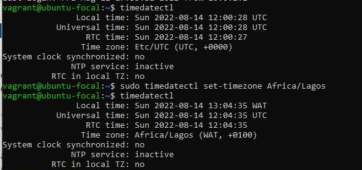

# AltSchool-Cloud-Exercices# 

This is the beginning of my journey in Altschool cloud Engineering track second semester. I am excited and pumped up to begin this exciting journey into the cloud. 

- [Overview](#overview)
- [What I learned](#what-i-learned)
- [My process](#my-process)
- [EXRCISE 2](#exercice-2)
- [EXRCISE 3](#exercice-3)
- [Author](#author)
- [Acknowledgments](#acknowledgments)


## Overview
LEARNING CLOUD ENGINEERING WITH ALTSCHOOL.

It has been exactly two weeks of learning cloud engineering with AltSchool and it has been the most exciting and tiring week for me.
This Project is a documentation of my progress in my chosen track.


### What I learned

This week I have learnt the different paths in cloud Engineering.
The history of and evolution of operating systems.
Evolution of Linux distros which is the most commonly used around the world.
I learned The difference between Physical hardware and virtual machines(VM) for which there is a need to set up a virtualization software.  
I also Learned several linux commands and still researching more.

It has been a loaded week of sleepless nights and a lot to learn, but the progress is well worth it. 


## My process
- Installed and set up VirtualBox
- Installed and set up Vagrant
- Installed and set up Ubuntu Focal 20.04LTS
We were given a task to set up Setup Ubuntu 20.04 LTS on our local machine using Vagrant and customize Vagrantfile as necessary with private_network set to dhcp. For this task, 
I downloaded, Installed and setup a vertualization software (Virtual Box) on my windows O/S.
I downloaded, Installed and setup Vagrant(A Development environment) on my windows O/S using git bash command.I also created a vagrant folder for vagrant initialization and set up on virtualBox. Finally installed and set up ubuntu focal 20.04LTS on vagrant. 

I particularly had a challenge configuring private networks on vagrant as it kept getting some errors each time I want to power up the machine. With the help of some my colleagues and a lot of google searching, i was able to finally set up the machine and configured it to private network. Here is the screenshot:


## EXRCISE 2
Private network set to "dhcp" and configuration: ifconfig. 
Note: see screenshot of output below.
<br/>
> 


## EXRCISE 3

``` $ cal ```
 Display current month calendar

``` $ w ```
 Display who is online

``` $ uptime ```  
  Display how long the system has been running


```bash
~$ cal    To Display current month calendar
 ~$ w     To Display who is online
 ~$ uptime  To Display how long the system has been running
```

> 


```bash

~$ timedatectl    [To Display current date and time]
~$ sudo timedatectl set-timezone Africa/Lagos     [To set currentdate and time to Afica/Lagos]
```

> 


## Author

- Website - [Bukola Testimony](https://bukola-testimony.github.io/My-Portfolio-website/)
Bukola-Testimony)
- Twitter - [@BukolaTestimony](https://twitter.com/BukolaTestimony)
