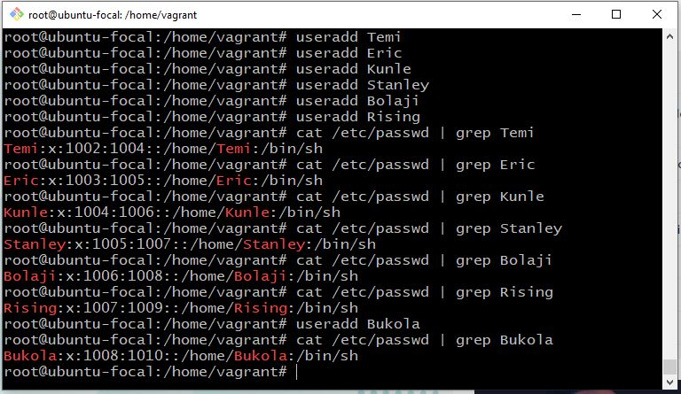
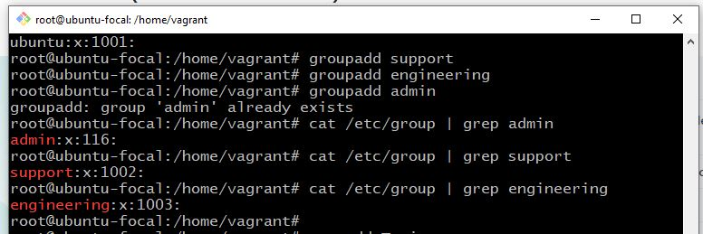
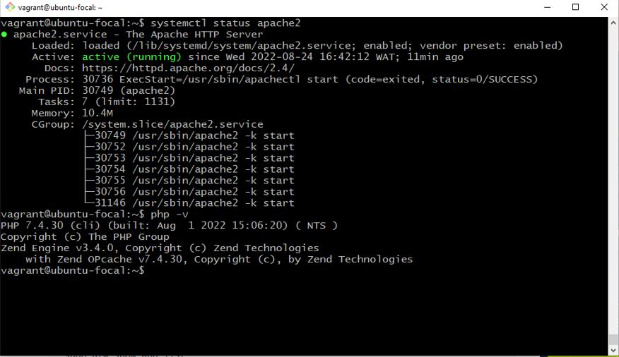

  # AltSchool-Cloud-Exercices-Week-2

> 

- [📔 introduction](https://github.com/Bukola-Testimony/AltSchool-Cloud-Exercices)
- [Overview](#overview) 
- [My process](#my-process)
- [Exercise 1](#exercise-1)
- [Exercise 2](#exercise-2)
- [Author](#author)


## Overview
LEARNING CLOUD ENGINEERING WITH ALTSCHOOL.

It has been exactly three weeks of learning cloud engineering with AltSchool.There has been so much concepts to learn. This week we learnt processes and file systems in linux, how to create users and groups, How to give sudo priviledges to users, how to add permissions and how to generate ssh keys. 
The highlight for me was when I discovered that by default, admin group have sudo priviledges and any user who has sudo rights has root priviledges.


## My process
- I created 2 groups: Support and Engineering. Admin group has already been created by default.
- Also by default, admin group belongs to the sudoers group which means that the user added to the admin group has sudo priviledges.
- I added users to each group
- I generated ssh keys for the user in the admin Group
- I installed PHP 7.4 using ppa:ondrej/php package repo


## EXERCISE 1
Task: Create 3 groups; admin, support and engineering.
create a user in each of the groups.
Add the admin group to sudoers.
Generate an ssh key for the user in the admin group.


#### Here is the screenshot:

## Creating users and groups  
Note: see screenshot of output below.
<br/>

#### created users
> 


#### created groups
> 


added users to groups
> 


contents of /etc/groups
> 


contents of /etc/password
> 


Generated ssh keys for user (Bukola) in the admin group:


## EXERCISE 2
Task : Install PHP 7.4 on your linux machine using the ppa:ondrej/php package repo.


###  Installation of PHP 7.4 using ppa:ondrej/php package repo and apache

```console

# How to Install PHP on Ubuntu 20.04 
~$ sudo apt install software-properties-common
~$ sudo add-apt-repository ppa:ondrej/php
~$ sudo apt update
~$ sudo apt install -y php7.4
~$ php -v 

```

### Screenshot of output of php -v
> 


### Content of etc/apt/souces.list.d

```console

~$ vi /etc/apt/souces.list 

```
> 


### Content of etc/apt/souces.list.d
```console

~$ vi /etc/apt/souces.list 

```
> 


## Author

- Website - [Bukola Testimony](https://bukola-testimony.github.io/My-Portfolio-website/)
- Twitter - [@BukolaTestimony](https://twitter.com/BukolaTestimony)
